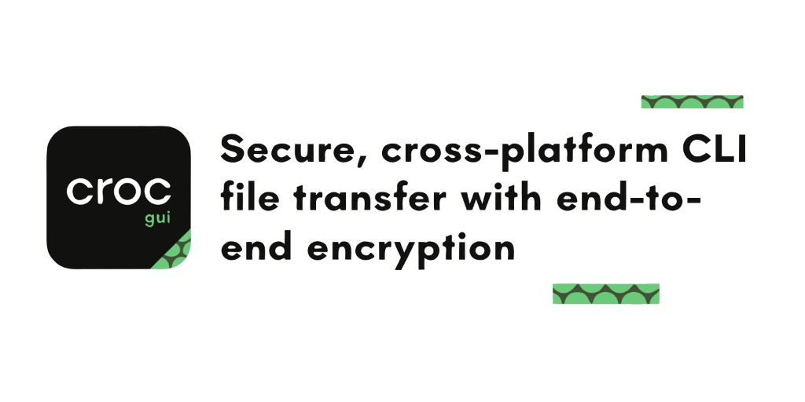
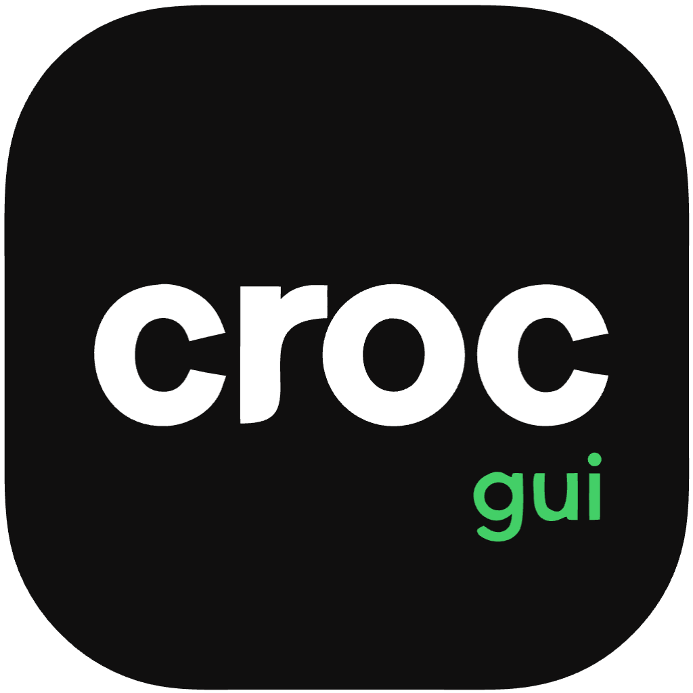

<p align="center">
  <a href="https://github.com/interfluve-wav/croc-gui">
    
  </a>
</p>

<p align="center">
  
</p>

<h1 align="center">Croc GUI — Secure Cross-Platform File Transfer</h1>

<p align="center">
  <strong>Desktop GUI for <a href="https://github.com/schollz/croc">croc</a></strong> — encrypted, peer-to-peer file transfer on
  <strong>macOS, Windows, and Linux</strong> with drag-and-drop, QR codes, and LAN mode.
  No cloud upload. No terminal required.
</p>

<p align="center">
  <a href="LICENSE"></a>
  <a href="#install--download"></a>
  <a href="https://tauri.app/"></a>
  <a href="https://github.com/interfluve-wav/croc-gui/actions/workflows/build-gui.yml"></a>
  <a href="https://github.com/interfluve-wav/croc-gui/releases"></a>
</p>

<p align="center">
  <a href="docs/UPSTREAM_ATTRIBUTION.md"></a>
  <a href="https://github.com/sponsors/schollz"></a>
  <a href="https://github.com/schollz/croc"></a>
  <a href="https://github.com/interfluve-wav/croc-gui"></a>
</p>

---

<details>
<summary>Architecture diagram</summary>


</details>

> **Social preview:** GitHub link previews usually pick up the hero banner at the top of this README. Brand images live in [`docs/images/`](docs/images/).

---

## Unofficial community project

> **Croc GUI is an unofficial, community-built desktop wrapper** around [schollz/croc](https://github.com/schollz/croc). It is **not** affiliated with, maintained by, or endorsed by Zack Scholl (schollz) or the upstream croc project unless they say so explicitly.

| | |
|---|---|
| **Transfer engine** | [schollz/croc](https://github.com/schollz/croc) by Zack Scholl — [Sponsor schollz](https://github.com/sponsors/schollz) |
| **This desktop app** | Built by **Suhaas** / [**interfluve-wav**](https://github.com/interfluve-wav) — [interfluve-wav/croc-gui](https://github.com/interfluve-wav/croc-gui) |

Attribution details, upstream etiquette, and how to notify schollz respectfully: [`docs/UPSTREAM_ATTRIBUTION.md`](docs/UPSTREAM_ATTRIBUTION.md).

---

## What this is

**Croc GUI** is a free, open-source **desktop app** for [croc](https://github.com/schollz/croc) — the popular tool for **secure, encrypted, peer-to-peer file transfer** without uploading to the cloud. Built with Tauri 2 + React, it bundles the croc binary and gives you a clear **Send / Receive** interface on **macOS, Windows, and Linux**.

Drag and drop files, share a **QR code** or code phrase, or run **local-only LAN** transfers — all with end-to-end encryption handled by upstream croc. No PATH setup, no memorizing CLI flags.

**Who it’s for:** anyone who wants fast, ad-hoc file sharing between devices — developers, teams, friends, or family — without leaving files on someone else’s server.

<p align="center">
  <a href="https://github.com/interfluve-wav/croc-gui/releases"><strong>⬇ Download for your OS</strong></a>
  &nbsp;·&nbsp;
  <a href="#quick-start"><strong>Try it</strong></a>
  &nbsp;·&nbsp;
  <a href="https://github.com/interfluve-wav/croc-gui"><strong>Star on GitHub</strong></a>
</p>

### Credits

| Layer | Credit |
|-------|--------|
| **croc** (transfer engine) | [Zack Scholl / schollz](https://github.com/schollz) — [schollz/croc](https://github.com/schollz/croc) — [Sponsor schollz](https://github.com/sponsors/schollz) |
| **Croc GUI** (this desktop app) | Built by **Suhaas** / [**interfluve-wav**](https://github.com/interfluve-wav) — [interfluve-wav/croc-gui](https://github.com/interfluve-wav/croc-gui) · [suhaaschitturi.com](https://suhaaschitturi.com) |

This repository is an **unofficial** GUI wrapper around upstream croc — not a claim of authorship over the protocol or CLI, and not an official schollz product.

---

## Features

- **Send / Receive** modes with live transfer status
- **Code phrase** display, copy phrase, and copy full `croc …` command
- **QR code** for the phrase (easy hand-off to a phone or second machine)
- **Drag-and-drop** send (files/folders) and paste/drop receive codes
- **Options:** custom code, relay, port, overwrite, auto-confirm (`-yes`)
- **Local-only** transfers (`croc --local`) — LAN peers, no public relay
- **Zip on send** (GUI packs selection into one archive, then sends it) and **zip after receive** (GUI helper)
- **Preferences:** remembered download folder and default relay
- **About** dialog with version and dual attribution (GUI + upstream)
- Bundled **croc** binary (no PATH dependency at runtime)

---

## Install / download

Prebuilt installers for **macOS, Windows, and Linux** are on **[GitHub Releases](https://github.com/interfluve-wav/croc-gui/releases)** — pick the file for your OS (no build required).

| Platform | Download this file |
|----------|-------------------|
| macOS (Apple Silicon) | `Croc_* (Apple Silicon).dmg` |
| macOS (Intel) | `Croc_*_x64.dmg` |
| Windows | `Croc_*_x64-setup.exe` |
| Linux (Debian/Ubuntu) | `Croc_*_amd64.deb` |
| Linux (AppImage) | `Croc_*_amd64.AppImage` |

Each release ships **five** installers (plus GitHub’s source archives). Older duplicate formats (`.msi`, `.rpm`, `.tar.gz`) are no longer published.

Releases are built automatically when a `v*` tag is pushed (see [Release Croc GUI](https://github.com/interfluve-wav/croc-gui/actions/workflows/release-gui.yml)). CI on `main` also runs [Build Croc GUI](https://github.com/interfluve-wav/croc-gui/actions/workflows/build-gui.yml) for pull-request checks.

**Build from source** only if you are developing or need an unreleased change — see [Building from source](#building-from-source) below.

---

## Quick start

### Use a release build

1. Download the installer for your OS from [Releases](https://github.com/interfluve-wav/croc-gui/releases).
2. Install and open **Croc**.
3. Choose **Send** or **Receive**, set options if needed, and transfer.

### Develop locally

```bash
git clone https://github.com/interfluve-wav/croc-gui.git
cd croc-gui/gui
npm install
npm run bundle:croc          # or: npm run bundle:croc:download
npm run tauri:dev
```

Developer details (prerequisites, zip behavior, artifact paths): [`gui/README.md`](gui/README.md).

---

## Building from source

Requirements: **Node.js 20+**, **Rust (stable)**, and platform UI libraries (see [`gui/README.md`](gui/README.md)).

```bash
cd gui
npm install
npm run bundle:croc:download   # stage matching upstream croc binary
npm run test:rust
npm run tauri:build
```

Installers land under `gui/src-tauri/target/release/bundle/` (or the architecture-specific target dir when cross-building on macOS).

| OS | Notes |
|----|--------|
| **macOS** | Xcode CLT; optional `rustup target add x86_64-apple-darwin` for Intel builds from Apple Silicon |
| **Windows** | MSVC Build Tools + WebView2 |
| **Linux** | WebKitGTK 4.1 + GTK 3 (Debian/Ubuntu package list in `gui/README.md`) |

Cross-platform packaging is covered by [`.github/workflows/build-gui.yml`](.github/workflows/build-gui.yml).

---

## Project layout

```
croc-gui/
├── gui/                 # Tauri 2 + React app
├── docs/                # Attribution notes and brand images
├── .github/             # CI, issue & PR templates
└── LICENSE
```

---

## Support & upstream

| Topic | Where |
|-------|--------|
| This GUI (UI, packaging, wrappers) | [Issues in this repo](https://github.com/interfluve-wav/croc-gui/issues) |
| croc protocol / CLI behavior | [schollz/croc issues](https://github.com/schollz/croc/issues) |
| Sponsor upstream | [github.com/sponsors/schollz](https://github.com/sponsors/schollz) |
| GUI maintainer | [interfluve-wav](https://github.com/interfluve-wav) · [Suhaas](https://suhaaschitturi.com) |
| Attribution & upstream etiquette | [`docs/UPSTREAM_ATTRIBUTION.md`](docs/UPSTREAM_ATTRIBUTION.md) |

More detail: [`SUPPORT.md`](SUPPORT.md).

---

## Contributing

See [`CONTRIBUTING.md`](CONTRIBUTING.md). Please follow the [`CODE_OF_CONDUCT.md`](CODE_OF_CONDUCT.md). Security reports: [`SECURITY.md`](SECURITY.md).

---

## License

- **This GUI** is MIT — see [`LICENSE`](LICENSE).
- **Upstream croc** is also MIT (copyright Zack Scholl / contributors). Bundled binaries remain under upstream’s terms. See [schollz/croc](https://github.com/schollz/croc) for the authoritative upstream license text.

---

<p align="center">
  <sub>
    <a href="https://github.com/interfluve-wav/croc-gui">Croc GUI</a> by
    <a href="https://github.com/interfluve-wav">Suhaas / interfluve-wav</a>
    · Powered by <a href="https://github.com/schollz/croc">schollz/croc</a>
    · <a href="https://github.com/sponsors/schollz">Sponsor schollz</a>
  </sub>
</p>
